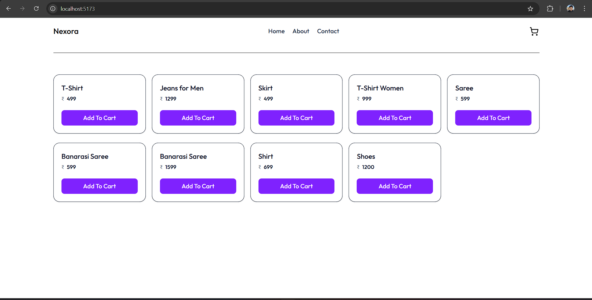
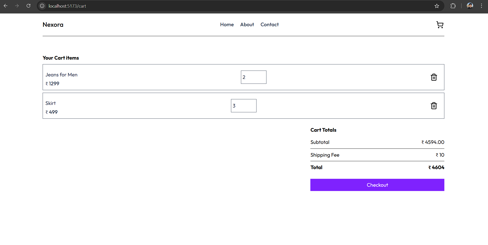
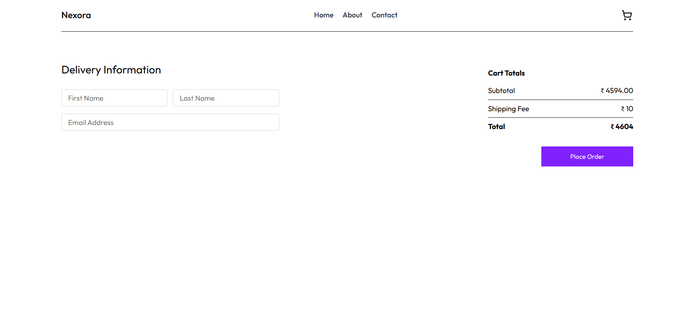

Full Stack Project Setup Guide

This repository contains both frontend (React) and backend (Node.js/Express) code.
Follow the steps below to clone the repository, install dependencies, and run the project locally.

<!-- Screen Shots -->
## 🖥️ Project Preview

Folder Structure

project-root/
│
├── frontend/   # React app
│
└── backend/    # Node.js + Express + MongoDB 

Clone the Repository

https://github.com/Ramprasadya/nexora.git

Setup Frontend

cd nexorafrontend
npm install
npm run dev

Setup Backend

cd backend
npm install
npm run dev

Create a .env file in backend and add your Mongog DB Url

MONGO_URI = "mongodb+srv://<usernmae>:<password>cluster0.ybpfopj.mongodb.net/nexora"

Author

Ramprasad yaadav
💼 GitHub: https://github.com/Ramprasadya

📧 Email: yadavramprasad563@gmail.com